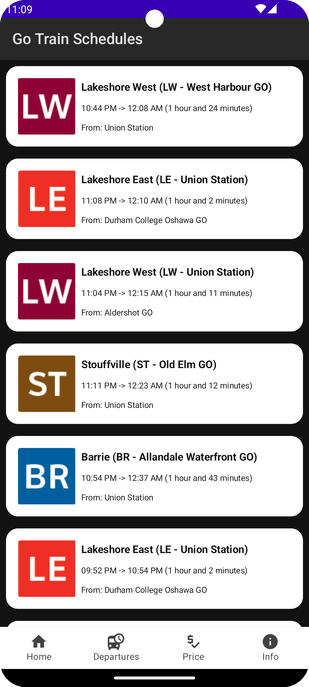
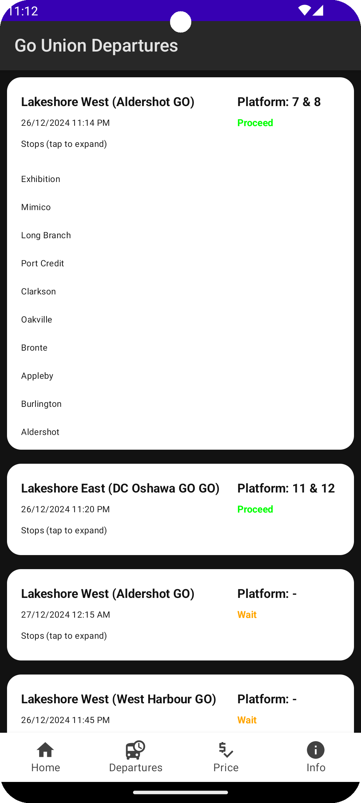
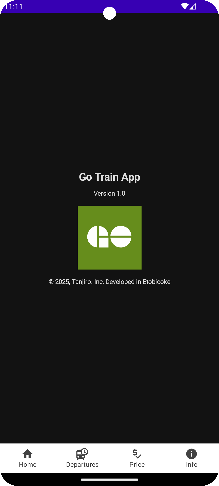

# Go Train Schedule App

This project is a Go Train Schedule application developed using Jetpack Compose for the UI and
Kotlin for the backend logic. The app provides information about train schedules, pricing, and other
relevant details that will be helpful for customers who will use this app, once its published to
PlayStore.

## Features

- Display train schedules and routes
- Show pricing information
- Expandable cards for detailed trip information
- Info screen with app details

## Pending feature work

- Fare Pricing tab
- More Helpful Features based on Postman project attached.
- More Unit Tests
- UI/UX changes or fixes on Font
- Colour / theme ?

## Screenshots





## Installation

1. Clone the repository:
    ```sh
    git clone https://github.com/shreyasmp/Go_Train_App.git
    ```
2. Open the project in Android Studio.
3. Build the project and run it on an emulator or a physical device.

## Usage

- **Home Screen**: Displays the main screen with navigation options.
- **Departures Screen**: Shows the list of train departures.
- **Pricing Screen**: Displays fare prices for different routes.
- **Info Screen**: Provides information about the app, including version and developer details.

## Code Structure

- `MainActivity.kt`: The main entry point of the app.
- `ui/tabs`: Contains the different screens of the app.
- `ui`: Contains UI components like `LineCard`.
- `view`: Contains view-related classes.
- `viewmodel`: Contains the ViewModel classes for managing UI-related data.

## Dependencies

- Jetpack Compose
- Coil for image loading
- Navigation component for Compose
- Flow and Coroutines for async programming

## License

This project is licensed under the MIT License. See the `LICENSE` file for more details.

## Contact

For any inquiries or feedback, please contact Shreyas Muthkur at [shreyasspidy@gmail.com].
