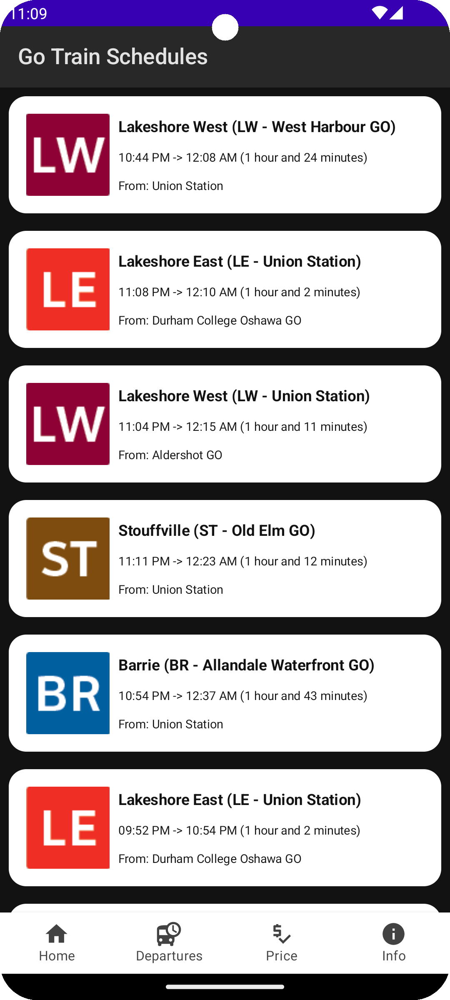
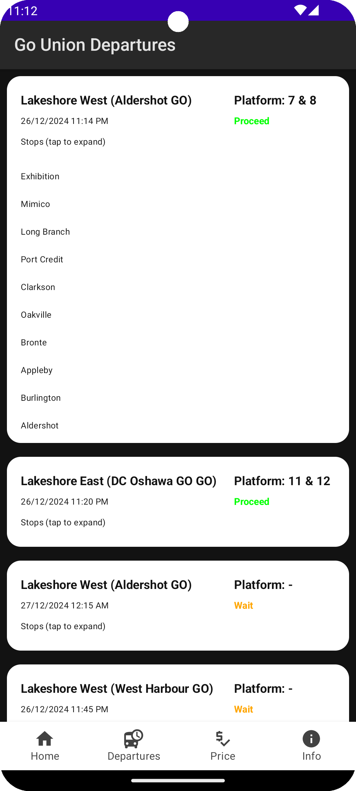
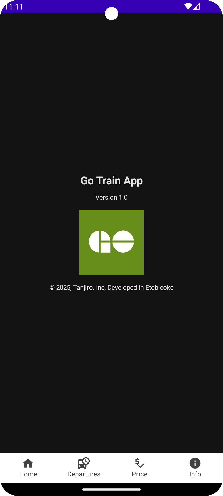

# Go Train Schedule App

This project is a Go Train Schedule application developed using Jetpack Compose for the UI and Kotlin for the backend logic. The app provides information about train schedules, pricing, and other relevant details.

## Features

- Display train schedules and routes
- Show pricing information
- Expandable cards for detailed trip information
- Info screen with app details

## Pending feature work

- Fare Pricing tab
- Unit Tests

## Screenshots





## Installation

1. Clone the repository:
    ```sh
    git clone https://github.com/shreyasmp/Go_Train_App.git
    ```
2. Open the project in Android Studio.
3. Build the project and run it on an emulator or a physical device.

## Usage

- **Home Screen**: Displays the main screen with navigation options.
- **Departures Screen**: Shows the list of train departures.
- **Pricing Screen**: Displays fare prices for different routes.
- **Info Screen**: Provides information about the app, including version and developer details.

## Code Structure

- `MainActivity.kt`: The main entry point of the app.
- `ui/tabs`: Contains the different screens of the app.
- `ui`: Contains UI components like `LineCard`.
- `view`: Contains view-related classes.
- `viewmodel`: Contains the ViewModel classes for managing UI-related data.

## Dependencies

- Jetpack Compose
- Coil for image loading
- Navigation component for Compose

## Contributing

1. Fork the repository.
2. Create a new branch (`git checkout -b feature-branch`).
3. Make your changes.
4. Commit your changes (`git commit -m 'Add some feature'`).
5. Push to the branch (`git push origin feature-branch`).
6. Open a pull request.

## License

This project is licensed under the MIT License. See the `LICENSE` file for more details.

## Contact

For any inquiries or feedback, please contact Shreyas Muthkur at [shreyasspidy@gmail.com].